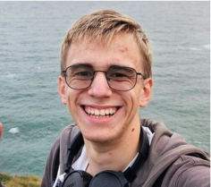
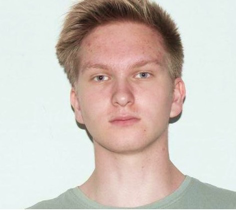
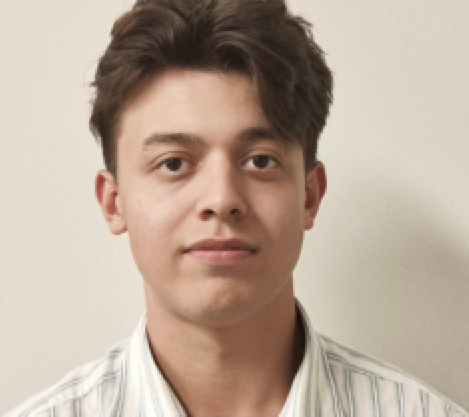

# Проект ParkTrack

---

**ParkTrack** — это система для мониторинга городских парковок с использованием технологий компьютерного зрения для определения автомобилей, отображения и прогнозирования занятости парковок с возможностью выбора оптимальной для точки назначения парковки и построения маршрута к ней.

Проект включает в себя несколько сервисов, таких как API для обработки данных и интеграция с внешними сервисами, админ-панель для управления источниками данных для партнеров, детектор автомобилей с анализатором занятости парковок, ML модель для прогнозирования заполненности парковок, мобильное приложение, а также веб-карта для отображения свободных парковок.

---

## 🚀 Ссылки

- **Сайт проекта:** [parktrack.live](https://parktrack.live)
- **Мобильное приложение:** [Releases](https://github.com/ParkTrack-Project/mobile-app/releases/latest)
- **Админ панель:** [admin.parktrack.live](https://parktrack.live)
- **Документация проекта:** [Документация](https://docs.parktrack.live)
- **Swagger UI (API):** [Swagger](https://swagger.parktrack.live)

---

## 🎤 Презентация проекта

С этой презентацией мы защищали проект 25 декабря на питч-сессии. Сюда мы включили самое интересное!

- **[Презентация](https://docs.google.com/presentation/d/1XaHSjsquaCjgxFFsKr2gTSaupm3Tv8n4eijxaQWxiVo/edit?usp=sharing)**

---

## 📂 Репозитории

### 1. **Документация**
- [**Сайт документации** (docs-website)](https://github.com/ParkTrack-Project/docs-website)
- [**Swagger** (api-docs-swagger)](https://github.com/ParkTrack-Project/api-docs-swagger)

### 2. **API сервер и база данных**
- [**API server** (api-server)](https://github.com/ParkTrack-Project/api-server)

### 3. **Админ-панель**
- [**Admin panel** (admin-panel)](https://github.com/ParkTrack-Project/admin-panel)

### 4. **Веб-карта свободных парковок**
- [**Map** (web-map)](https://github.com/ParkTrack-Project/web-map)

### 5. **Детектор автомобилей и анализатор занятости**
- [**Car detector** (car-detector)](https://github.com/ParkTrack-Project/car-detector)
- [**Дообучение модели YOLOv12** (yolo_model_training)](https://github.com/ParkTrack-Project/yolo_model_training)
- [**Выпрямление изображения с широкоугольных камер** (camera_image_fix)](https://github.com/ParkTrack-Project/camera_image_fix)

### 6. **ML модель предсказания заполненности парковок**
- [**Occupancy prediction service** (ml-prediction)](https://github.com/ParkTrack-Project/ml-prediction)

### 7. **Мобильное приложение**
- [**Mobile app** (mobile-app)](https://github.com/ParkTrack-Project/mobile-app)

---

## 👥 Команда

|                                                                                                                                                                                             |  |                    |
|--------------------------------------------------------------------------------------------------------------------------------------------------------------------------------------------------------------------------------------------|-------------------------------------------------|-----------------------------------------------------------------|
| 
[Никита Аксенов](https://github.com/nawinds) <a href="https://t.me/nawinds">nawinds</a> | 
Андрей Кудлис
             | 
[Егор Столбов](https://github.com/Gogobobo11) |
| 
*Tech Director*
                                                                                                                                                                                                      | 
*Поиск партнеров*
         | 
*Backend Engineer*
                        | 

|                    |              |                  |
|--------------------------------------------------------------------|-------------------------------------------------------------|-----------------------------------------------------------------|
| 
[Дмитрий Олифер](https://github.com/Lukramancer) | 
[Кирилл Сурков](https://github.com/Ru1ka) | 
[Руслан Беганов](https://github.com/BeganovR) |
| 
*DevOps*
                                     | 
*CV Engineer*
                         | 
*ML Forecast Engineer*
                    |

|                    |                 |                |
|-----------------------------------------------------------------|----------------------------------------------------------------|---------------------------------------------------------------|
| 
[Егор Столбов](https://github.com/Gogobobo11) | 
[Илья Россеев](https://github.com/666mxvbee) | 
[Илья Киселев](https://github.com/Mentigen) |
| 
*Backend Engineer*
                        | 
*Web Engineer*
                           | 
*Mobile Engineer*
                       |

---
