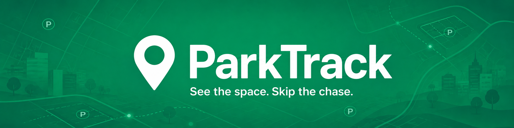

  

---

## About ParkTrack

**ParkTrack** is an urban parking monitoring platform powered by computer vision, real-time occupancy analytics and machine learning.

The system detects vehicles on city camera feeds, displays current parking availability, forecasts parking occupancy and helps drivers choose the most suitable parking area near their destination. ParkTrack also supports route building, allowing users to navigate directly to the selected parking location.

The project is built as an ecosystem of connected services: a data-processing API with external integrations, an admin panel for partners and data-source management, a vehicle detector with a parking occupancy analyzer, an ML-based occupancy prediction service, a mobile application and a web map for displaying available parking spaces.

---

## Links

- **Website:** [parktrack.live](https://parktrack.live)
- **Mobile App:** [Releases](https://github.com/ParkTrack-Project/mobile-app/releases/latest)
- **Admin Panel:** [admin.parktrack.live](https://admin.parktrack.live)
- **Documentation:** [docs.parktrack.live](https://docs.parktrack.live)
- **Swagger UI:** [swagger.parktrack.live](https://swagger.parktrack.live)

---

## Project Presentation

This presentation was used to pitch **ParkTrack** on **December 25**. It includes the core product idea, system architecture, technical approach and the most important highlights of the project.

- **[ParkTrack Presentation](https://docs.google.com/presentation/d/1XaHSjsquaCjgxFFsKr2gTSaupm3Tv8n4eijxaQWxiVo/edit?usp=sharing)**

---

## Repositories

### 1. Documentation

- [**Documentation Website** (`docs-website`)](https://github.com/ParkTrack-Project/docs-website)  
  Public documentation website for the ParkTrack platform.

- [**Swagger / OpenAPI Documentation** (`api-docs-swagger`)](https://github.com/ParkTrack-Project/api-docs-swagger)  
  API specification and Swagger UI configuration for exploring ParkTrack endpoints.

### 2. API Server and Database

- [**API Server** (`api-server`)](https://github.com/ParkTrack-Project/api-server)  
  Core backend service responsible for data processing, business logic, database access and integrations with external services.

### 3. Admin Panel

- [**Admin Panel** (`admin-panel`)](https://github.com/ParkTrack-Project/admin-panel)  
  Partner-facing administration interface for managing parking zones, cameras, data sources and platform configuration.

### 4. Web Map

- [**Web Map** (`web-map`)](https://github.com/ParkTrack-Project/web-map)  
  Interactive web application for displaying parking availability on a city map.

### 5. Vehicle Detection and Occupancy Analysis

- [**Car Detector** (`car-detector`)](https://github.com/ParkTrack-Project/car-detector)  
  Computer vision service for vehicle detection and parking occupancy analysis.

- [**YOLOv12 Model Training** (`yolo_model_training`)](https://github.com/ParkTrack-Project/yolo_model_training)  
  Training pipeline, experiments and resources for improving the vehicle detection model.

- [**Wide-Angle Camera Image Correction** (`camera_image_fix`)](https://github.com/ParkTrack-Project/camera_image_fix)  
  Tools for correcting distortion in images from wide-angle city cameras.

### 6. ML-Based Occupancy Forecasting

- [**Occupancy Prediction Service** (`ml-prediction`)](https://github.com/ParkTrack-Project/ml-prediction)  
  Machine learning service for forecasting parking occupancy based on historical and real-time data.

### 7. Mobile Application

- [**Mobile App** (`mobile-app`)](https://github.com/ParkTrack-Project/mobile-app)  
  End-user mobile application for finding available parking, selecting the best option and navigating to it.

---

## Team

<table>
<tr>
<td style="width: 168px; text-align: center"></td>
<td style="width: 168px; text-align: center"></td>
<td style="width: 168px; text-align: center"></td>
</tr>
<tr>
<td style="width: 168px; text-align: center"><a href="https://github.com/nawinds">Nikita Aksenov</a> <a href="https://t.me/nawinds">nawinds</a></td>
<td style="width: 168px; text-align: center">Andrey Kudlis</td>
<td style="width: 168px; text-align: center"><a href="https://github.com/Gogobobo11">Egor Stolbov</a></td>
</tr>
<tr>
<td style="width: 168px; text-align: center"><i>Engineering Lead</i></td>
<td style="width: 168px; text-align: center"><i>Partnerships & Growth</i></td>
<td style="width: 168px; text-align: center"><i>Backend Engineer</i></td>
</tr>
</table>

<table>
<tr>
<td style="width: 168px; text-align: center"></td>
<td style="width: 168px; text-align: center"></td>
<td style="width: 168px; text-align: center"></td>
</tr>
<tr>
<td style="width: 168px; text-align: center"><a href="https://github.com/Lukramancer">Dmitry Olifer</a></td>
<td style="width: 168px; text-align: center"><a href="https://github.com/Ru1ka">Kirill Surkov</a></td>
<td style="width: 168px; text-align: center"><a href="https://github.com/BeganovR">Ruslan Beganov</a></td>
</tr>
<tr>
<td style="width: 168px; text-align: center"><i>Infrastructure & DevOps</i></td>
<td style="width: 168px; text-align: center"><i>Computer Vision   Engineer</i></td>
<td style="width: 168px; text-align: center"><i>ML Forecasting   Engineer</i></td>
</tr>
</table>

<table>
<tr>
<td style="width: 168px; text-align: center"></td>
<td style="width: 168px; text-align: center"></td>
<td style="width: 168px; text-align: center"></td>
</tr>
<tr>
<td style="width: 168px; text-align: center"><a href="https://github.com/666mxvbee">Mikhail Neganov</a></td>
<td style="width: 168px; text-align: center"><a href="https://github.com/MrGoldSky">Ilya Kiselev</a></td>
<td style="width: 168px; text-align: center"><a href="https://github.com/Mentigen">Ilya Kiselev</a></td>
</tr>
<tr>
<td style="width: 168px; text-align: center"><i>Frontend Engineer   (Admin panel)</i></td>
<td style="width: 168px; text-align: center"><i>Frontend Engineer   (Web Map)</i></td>
<td style="width: 168px; text-align: center"><i>Mobile Engineer</i></td>
</tr>
</table>

---

## Partner with ParkTrack

ParkTrack is actively looking for partners who can help us improve real-time parking visibility in urban areas.

We are interested in working with organizations that can provide access to parking-related data sources, including:

* city camera feeds;
* parking cameras near businesses, venues or residential areas;
* aggregated GPS traces from car-sharing or mobility services;
* navigation session data;
* parking service data;
* parking payment and session data;
* any other signals that can help estimate parking occupancy.

If your organization has access to such data or infrastructure, we would be happy to discuss a partnership.

**Contact us:** [partners@parktrack.live](mailto:partners@parktrack.live)

### What our partners receive

By joining ParkTrack, partners can become part of a smart-city initiative that makes parking more transparent, convenient and data-driven.

For local businesses, cafes, restaurants and venues, partnership may provide additional value:

* **More visibility on the ParkTrack map**
  Parking areas without reliable real-time data are treated conservatively. Once connected to ParkTrack, available spaces near your location can become visible to users, making it easier for them to choose your area as a destination.

* **Free promotion inside the product**
  We can highlight your venue on the map, display it near available parking areas and show messages such as "parking available near [venue name]".

* **Targeted offers for drivers**
  Partners may run contextual promotions, for example: "Free parking nearby + 10% off coffee with promo code PARKTRACK". Such offers can be configured to appear selectively rather than every time.

* **Guest parking visibility**
  If applicable, ParkTrack can mark certain parking areas as available for guests of a venue.

* **Analytics and forecasting**
  Partners can receive insights into parking occupancy patterns, including days and hours with the highest demand.

* **Modern smart-city image**
  Participation in ParkTrack positions your business as a technology-friendly and socially useful urban partner.

* **PR opportunities**
  We can mention partners in project updates, social media or city-focused publications. Partners can also use the collaboration in their own communications: "Parking near us is now easier with ParkTrack."

* **Trial period**
  We can start with a short 2-3 week pilot. If the partnership does not work for you, we can disable the integration.

* **Free access to the service**
  Early partners receive lifetime free access to ParkTrack.

* **Influence on the product**
  Partners can participate in shaping how parking data is displayed and suggest features that would make the service more useful for real businesses and drivers.

* **Early-partner benefits**
  First-stage partners may receive better long-term conditions, including priority placement or local exclusivity where appropriate.
